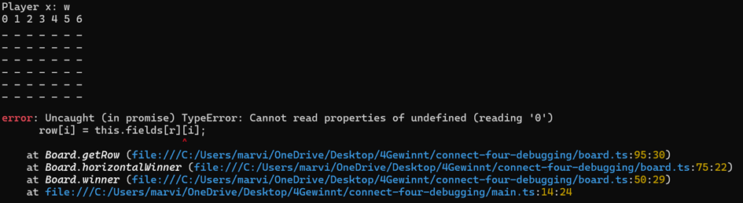

2. Debbuging Techniken Anwenden
- In makeMove habe ich gesehen, dass die Eingaben nicht validiert werden. Dies ist sofern Problematisch, dass Buchstaben unnd oder auch zu grosse Zahlen eingeben kann. Das führt zu Fehlern.
- ich habe versucht zuerst den Code richtig zu verstehen und einfach durch das durchspiele im Kopf zu analysieren.
- Da ich mir den Fehlerfall herausgesucht habe, dass es keine Eingabe-Validierung gibt, war es relativ leicht zu sehen, dass diese Validierung einfach noch nicht vorhande ist.

3. Lösung für das Problem
- Durch das einbauen einer Valididerung, und im Falle eines Verstosses das Werfen einer Fehlermeldung, wird der Spieler nun durch die Message informiert was er falsch gemacht hat und kann es beim nächsten mal besser machen.
