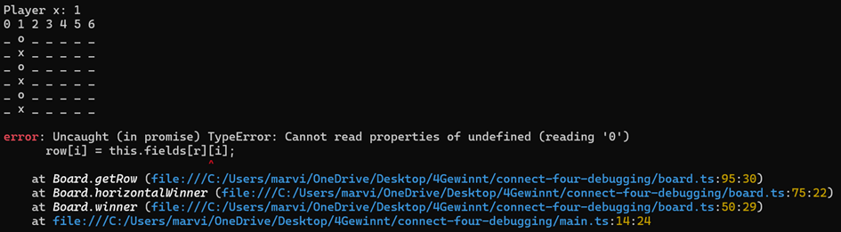

1. Erste Analyse
 - Die Einagaben sind nicht validiert. Wenn ein Buchstabe oder ein ungültiger Wert eingegeben wird, wird ein Error geworfen (siehe Bild), der Error wird nicht abgefangen.

- Das Spiel wurde vorzeitig beendet, obwohl keine Vierer-Reihe vorhanden war.

- Das platzieren von Steinen in einer vollen Spalte führt auch zum Absturz und zur folgenden Fehlermeldung:

